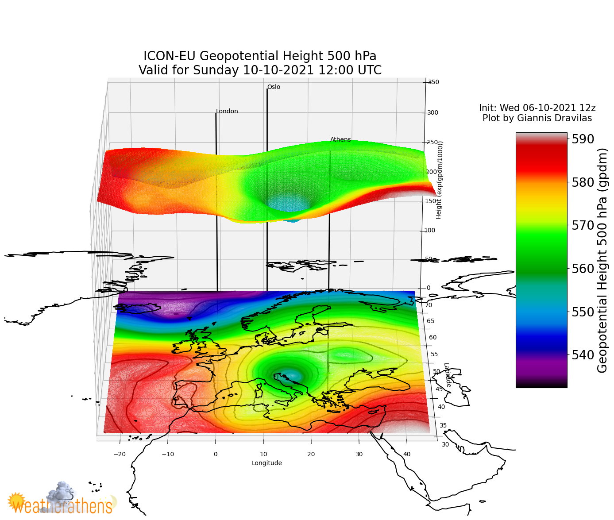

# Weather-Plotting

This repository contains some examples for creating 2d and 3d weather plots using matplotlib and cartopy libraries in python3.
 
Every directory also contains samples depicting the result of the provided code.

__geopHeight3d__

Creates a 3d plot of the Geopotential Height on the level of 500 hPa on a given date, according to ICON-EU forecasting model's real-time data provided by the DWD. The z axis has a reduced scale and limits for a better representation of the 3d surface. A basemap using cartopy, is also used, combined with a simple contour plot on level 0, producing a projection of the data on a simple x,y layer.

__hurricaneTrack__

Creates a 2d plot of the hurricane Ida's track, which hit USA on 2021. The track is plotted on a 6-hour step, using a cyclone thumbnail on a geophysical basemap provided by NOAA. The maximum wind speed around the hurricane's track is also plotted, using a contour plot.

__precipitationGreece__

Creates a 2d plot of the accumulated precipitation in Greece on a given date, according to ICON-EU forecasting model's real-time data provided by the DWD and using a NWS' colormap.

__General Information and Copyrights__

The code and plots contained in this repository were created on behalf of [Weatherathens](http://weatherathens.blogspot.com/) and may not be copied, distributed, reproduced, published or displayed without giving credit and getting a written permission by the owner.
  
New plots may be added in the future.